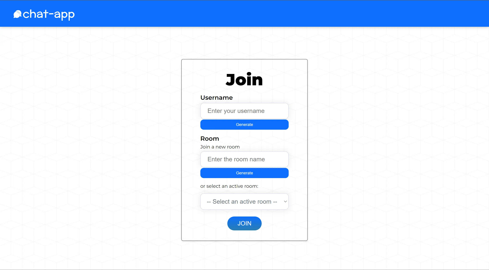
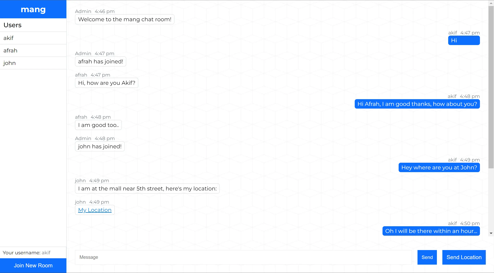

# chat-app

> A chat app built using Node.js (backend) and React (frontend) and Socket.IO for data sharing. It makes use of the concept of web sockets to enable real time communications.
> Live demo [_here_](https://akiif.github.io/chat-app).

## Table of contents

-   [General info](#general-info)
-   [Technologies](#technologies)
-   [Gallery](#gallery)
-   [Features](#features)
-   [Setup](#setup)
-   [Contact](#contact)

## General info

A chat app built using Node.js (backend) and React (frontend) and Socket.IO for data sharing. It makes use of the concept of web sockets to enable real time communications.

## Technologies

-   Express 4.18.2
-   React 18.2.0
-   Node.js 18.2.1
-   Socket.IO 4.6.0
-   Redux 4.2.1
-   Vite 3.2.3

## Gallery
- Join Page:


- Chat Page:


## Features

-   The website consists of Two pages, i.e Join and Chat page.
-   The user has to enter a username and the room name or generate one to join a chat room.
-   Additionally, the user can select one of the existing chat rooms to join.
-   The user details and the messages are stored in the redux state.
-   The real time communication is made possible by using socket.io with socket.io-client on the client side and socket.io on the server side.
-   The user can send a plain text message by clicking on the send button or their location as a link to google maps by clicking on the send location button.

## Setup

To run this project:

-   Download the project code or clone it using git clone.
-   Make sure you have [NodeJs](https://nodejs.org/en/) and [yarn](https://classic.yarnpkg.com/lang/en/docs/install/#windows-stable) installed in your system.
-   Then, Install it locally using yarn:

```
$ cd chat-app
$ yarn initialize-app  # installs both the client and server dependencies
$ yarn start    # or 'yarn dev' if you have nodemon.
```

## Contact

Created by [@akiif](https://akiif.dev/) - feel free to contact me!
